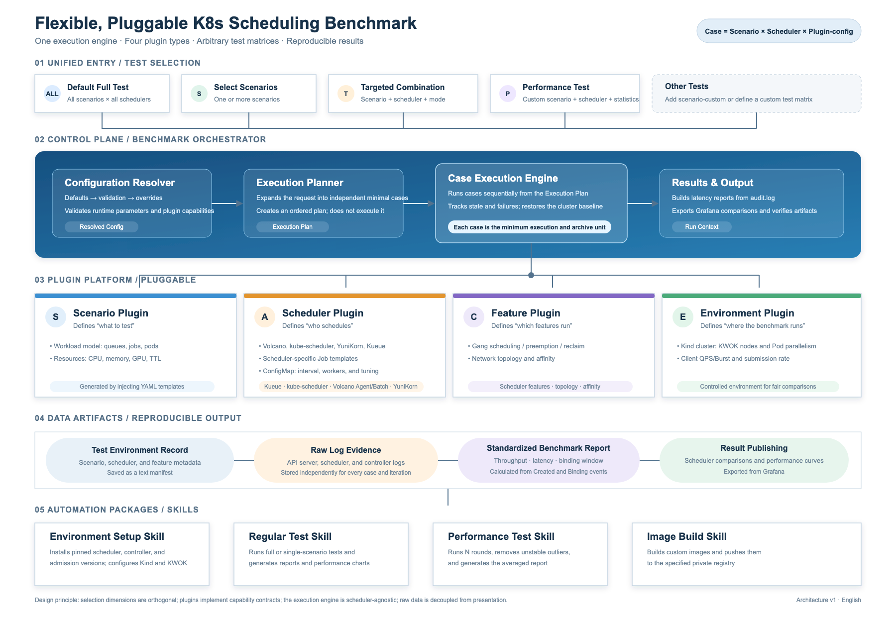
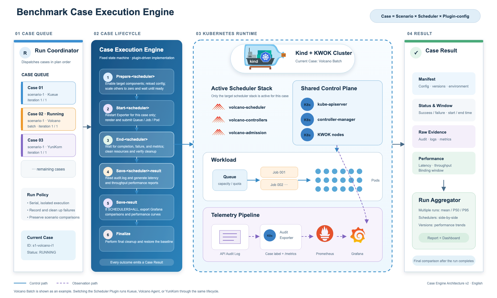

# Kubernetes Scheduling Performance Benchmark

English | [简体中文](README_zh.md)

A comparative benchmark framework for Kueue, Volcano, and Apache YuniKorn. It runs identical batch workloads serially on a reusable Kind + KWOK cluster, isolates scheduler components between runs, and stores API Server audit metrics, scheduling statistics, and Grafana panels in stable scenario result directories.

## Architecture



## Resident Kind Cluster

This is currently the only supported execution mode. A fresh installation creates one Kind control-plane node and 1000 KWOK nodes, then installs all three scheduler stacks and the monitoring components. Benchmark runs switch components and clean experiment resources without rebuilding the cluster. Generic existing Kubernetes clusters are not yet supported.

### Prerequisites

- Docker, Kind `v0.32.0`, Helm 3, curl, jq, Make, tar, sha256sum, ss, and install
- Recommended reference host: Ubuntu 24.04, 32 logical CPUs, and 62 GiB memory

### One-Command Installation (Fresh Cluster)

```bash
sudo -i
cd /path/to/kube-scheduling-perf
make setup
make up
```

`make setup` stages the deployment bundle, checks the host, creates a 100-node canary environment, installs and smoke-tests the scheduler and monitoring stacks, scales to 1000 KWOK nodes, and performs final verification. `make up` verifies the cluster and builds the test binaries.

> This command is for fresh deployments only. It refuses to run when a cluster with the same name already exists and never deletes or rolls back a cluster automatically. If Kind creation stops partway through, inspect and complete the control-plane configuration, or explicitly delete the incomplete cluster only after confirming that it contains no data to preserve.

### Step-by-Step Installation

Run all commands from the repository root in a root shell.

#### 1. Prepare the Deployment Bundle

```bash
make prepare-resident
```

Stages the deployment bundle, checks the host, and prepares kubectl plus scheduler and monitoring artifacts.

#### 2. Create the Kind Cluster

```bash
make create-cluster
```

Creates the control plane and enables API Server auditing.

#### 3. Create KWOK Nodes

```bash
make create-nodes
```

Installs KWOK and creates and verifies 100 canary nodes.

#### 4. Install Schedulers

```bash
make install-schedulers
```

Installs Kueue/Coscheduling, Volcano, and YuniKorn, then runs scheduler smoke tests.

#### 5. Install Audit Exporter and Monitoring

```bash
make install-monitoring
```

Installs Audit Exporter, Prometheus, Grafana, and the image renderer.

#### 6. Install Grafana Ingress

```bash
make install-grafana-ingress
```

#### 7. Scale and Verify

```bash
make scale-nodes
make verify-resident
make up
```

Scales to 1000 KWOK nodes, verifies the cluster, scheduler stacks, monitoring, and Ingress, and then builds the test binaries. Smoke tests create and remove real resources, while node scaling only adds missing nodes. See the [deployment bundle documentation](deploy/resident/README.md) for recovery after a partial installation. Grafana allows anonymous access, so restrict external access to ports `31003`, `31004`, and `31005`.

### Fixed Baseline

| Item | Baseline |
| --- | --- |
| Cluster | `volcano-benchmark-1348`; Kubernetes `v1.34.8` |
| Nodes | 1 control-plane node + 1000 KWOK `v0.7.0` nodes |
| Scheduler stacks | Volcano `v1.15.1`; Kueue `v0.19.0`; Coscheduling `v0.34.7`; YuniKorn `v1.9.0` |
| Monitoring | kube-prometheus-stack `88.1.3` |
| Deployment directory | `/root/benchmark-1348-deploy` |
| Endpoints | Prometheus `31003`; Grafana `31004`; Grafana Ingress `31005` |

The installation path is currently fixed. For an equivalent manually provisioned environment, benchmark execution may override `KIND_CLUSTER_NAME`, `KUBECONFIG`, `KUBECTL`, and `RESIDENT_DEPLOY_DIR`. See [CLUSTER_DEPLOYMENT_RECORD.md](CLUSTER_DEPLOYMENT_RECORD.md) for the complete versions, resource baseline, and known risks.

## Running Benchmarks

Before using any test mode, verify the resident cluster and build the test binaries:

```bash
make up
```

All four test modes share the same component switching, workload submission, metrics barrier, result saving, and resource cleanup flow:



### 1. Integrity Test

```bash
make
```

The integrity test runs the following eight fixed scenarios. Every scenario uses one queue and creates 10000 Pods, runs Kueue → Volcano → YuniKorn in order, and contributes three of the 24 total `TestBatchJob` cases.

| Scenario | Mode | Jobs | Pods per job | Volcano `auto` mode | Per-scheduler timeout |
| ---: | --- | ---: | ---: | --- | ---: |
| 1 | Non-Gang | 10000 | 1 | Agent | 350s |
| 2 | Non-Gang | 500 | 20 | Agent | 200s |
| 3 | Non-Gang | 20 | 500 | Agent | 160s |
| 4 | Non-Gang | 1 | 10000 | Agent | 190s |
| 5 | Gang | 10000 | 1 | Batch | 430s |
| 6 | Gang | 500 | 20 | Batch | 310s |
| 7 | Gang | 20 | 500 | Batch | 310s |
| 8 | Gang | 1 | 10000 | Batch | 400s |

To use the Volcano Batch Scheduler in all eight scenarios:

```bash
make VOLCANO_MODE=batch
```

At minimum, a passing integrity test requires successful top-level `make` and final `make down` commands, 24/24 passing cases and metrics barriers, all eight result directories updated, zero residual test resources, and restoration of the idle baseline. A Dashboard image failure is recorded as a non-blocking anomaly.

The `serial-test` substeps are joined with semicolons, so later steps can continue after an intermediate failure. Do not determine success from the top-level exit code alone.

### 2. Fixed-Scenario Test Mode

Run one fixed scenario against all three scheduler stacks:

```bash
make scenario-2
```

`scenario-1` through `scenario-8` correspond to the table above. Each scenario runs Kueue → Volcano → YuniKorn serially and produces a three-scheduler comparison. Kueue uses the default kube-scheduler for non-Gang scenarios and Coscheduling for Gang scenarios.

### 3. Single-Scheduler, Fixed-Scenario Test Mode

Run only Volcano for scenario 2:

```bash
make scenario-2 SCHEDULERS=volcano
```

`SCHEDULERS` must be `kueue`, `volcano`, or `yunikorn`. Volcano also supports an explicit scheduler mode:

- `auto`: Agent for scenarios 1–4 and Batch for scenarios 5–8.
- `agent`: native `batch/v1` Jobs; Gang is unsupported.
- `batch`: Volcano VCJobs with Gang support.

For example, run scenario 2 with the Volcano Batch Scheduler:

```bash
make scenario-2 SCHEDULERS=volcano VOLCANO_MODE=batch
```

Single-scheduler mode updates only that scheduler's result directory and does not generate or replace the three-scheduler relative Dashboard. When Volcano is selected, `agent` combined with `GANG=true` is rejected.

### 4. Custom-Scenario, Single-Scheduler Test Mode

`scenario-custom` reuses the same preparation, test, metrics, cleanup, and result-saving flow, but accepts exactly one scheduler and does not generate a relative Dashboard.

By default it runs the Volcano Batch Scheduler with 50 Jobs, 16 Pods per Job, and Gang disabled:

```bash
make scenario-custom
```

Override the workload from the command line:

```bash
make scenario-custom \
  SCHEDULERS=volcano \
  VOLCANO_MODE=batch \
  JOBS_SIZE_PER_QUEUE=100 \
  PODS_SIZE_PER_JOB=8 \
  GANG=true \
  PREEMPTION=false \
  TEST_TIMEOUT_SECONDS=600
```

Results are written to `results/scenario-custom/`. Repeated runs update the selected scheduler directory plus `envs.txt` and `result-window.txt` without changing scenarios 1–8; result directories left by other custom scheduler runs are retained. `SCHEDULERS` must contain exactly one of `kueue`, `volcano`, or `yunikorn`.

### 5. View Results

Full scenario runs use stable result directories and replace artifacts for the active Volcano mode:

```text
results/
└── scenario-<1..8>/
    ├── envs.txt
    ├── result-window.txt
    ├── job-submission-agent.png   # Volcano Agent mode
    ├── job-submission.png         # Volcano Batch mode
    ├── kueue/
    │   ├── window.txt
    │   └── report.txt
    ├── volcano-agent/ or volcano/ # Active Volcano mode
    │   ├── window.txt
    │   └── report.txt
    └── yunikorn/
        ├── window.txt
        └── report.txt
```

A full three-scheduler run saves either `volcano-agent/` or `volcano/` for the active mode. Agent and Batch Dashboard images may coexist; a new run replaces only the active mode's image. If a later single-scheduler run uses the other Volcano mode, both Volcano report directories may coexist.

Each `report.txt` computes Pod create-to-bind P50, P90, and P99 latency, the scheduled Pod count, throughput, and the throughput window directly from the run's API Server audit-log byte range rather than from Prometheus Histogram estimates. A numbered single-scheduler run replaces only its scheduler result directory and leaves the full-comparison metadata and relative Dashboard unchanged.

Persistent Grafana endpoint:

```text
http://<benchmark-server>:31005/grafana/d/perf/?theme=light
```

### 6. Recover from an Interrupted Run

```bash
make down
```

This enables all scheduler components and Audit Exporter, removes Kueue, Volcano, and YuniKorn test resources, waits for the fixed replica baseline, and verifies the base cluster. It does not depend on saved pre-run state.

## Reference

### Benchmark Parameters

| Variable | Default | Description |
| --- | ---: | --- |
| `SCHEDULERS` | `kueue volcano yunikorn` | Scheduler stacks and execution order |
| `VOLCANO_MODE` | `auto` | Volcano mode: `auto`, `agent`, or `batch` |
| `QUEUES_SIZE` | `1` | Number of benchmark queues |
| `JOBS_SIZE_PER_QUEUE` | `1` | Jobs created in each queue |
| `PODS_SIZE_PER_JOB` | `1` | Pods created by each Job |
| `CPU_REQUEST_PER_POD` | `1` | CPU request per Pod |
| `MEMORY_REQUEST_PER_POD` | `1Gi` | Memory request per Pod |
| `CPU_PER_QUEUE` | `10000` | Queue CPU capacity |
| `MEMORY_PER_QUEUE` | `10000Gi` | Queue memory capacity |
| `GANG` | `false` | Enable Gang scheduling semantics |
| `PREEMPTION` | `false` | Enable preemption scenarios |
| `TEST_TIMEOUT_SECONDS` | `3600` | Go test timeout for one scheduler case |
| `CLEANUP_TIMEOUT_SECONDS` | `600` | Maximum wait for Kueue namespace cleanup |
| `RESULT_METRICS_TIMEOUT_SECONDS` | `240` | Maximum wait for stable metrics to be scraped by Prometheus |

Additional impacting and critical workload variables are defined at the top of the [Makefile](Makefile).

### Metrics Collection

This project uses [kube-apiserver-audit-exporter](https://github.com/songmingming0827/kube-apiserver-audit-exporter) to convert kube-apiserver audit events into Prometheus metrics for scheduling latency, API requests, and workload scheduling statistics. Its design, metric definitions, configuration, and deployment are maintained in that repository.

### Benchmark Variability

To reduce throughput and latency variation across repeated benchmark runs, the baseline standardizes three areas:

1. **Fixed Volcano scheduling interval**: the Batch Scheduler uses a fixed `200ms` `schedule-period`, while the Agent Scheduler remains event-driven, avoiding differences caused by scheduling-cycle configuration.
2. **Isolated Pod deletion effects**: VCJob TTL and cleanup behavior are fixed, and each run waits for test resources to reach zero, reducing interference from Garbage Collector deletion events and Scheduler cache updates in subsequent runs.
3. **Reduced KWOK lifecycle concurrency**: `podPlayStageParallelism` is fixed at `1`, spreading Running, Succeeded, and Deleted state updates over time and reducing cache and runtime contention from concentrated `UpdatePod` events.

### Scheduler Stacks

| Stack | Components and behavior |
| --- | --- |
| Kueue | Kueue Controller; default kube-scheduler for non-Gang scenarios and Coscheduling Scheduler and Controller for Gang scenarios |
| Volcano | Agent Scheduler and Admission in Agent mode; Batch Scheduler, Controllers, and Admission in Batch mode |
| YuniKorn | YuniKorn Scheduler and Admission Controller |

The three benchmark stacks use the `bench-kueue`, `bench-volcano`, and `bench-yunikorn` namespaces. While one stack is under test, all other scheduler stacks are scaled to zero. After the test, the framework cleans namespaced and related cluster-scoped resources and restores all scheduler components to one replica.

### Repository Layout

```text
Makefile                    # Environment setup, benchmark, cleanup, and result-archiving entry point
deploy/resident/            # Versioned resident-cluster deployment bundle
deploy/grafana-ingress/     # Persistent Grafana Ingress
hack/                       # Result collection, Dashboard, and helper scripts
test/                       # Kueue, Volcano, and YuniKorn tests and shared utilities
results/                    # Generated benchmark results
doc/                        # Reviews, analyses, and historical test documents
```

Further reading:

- [Integrity test report — Volcano Batch Scheduler](perf-analysis-report.md)
- [Integrity test report — Volcano Agent Scheduler](perf-analysis-report-agent.md)
- [Resident cluster deployment bundle](deploy/resident/README.md)
- [Resident cluster design details](RESIDENT_CLUSTER_PLAN_DETAIL.md)
- [Cluster deployment record](CLUSTER_DEPLOYMENT_RECORD.md)
- [Historical full test report](doc/RESIDENT_CLUSTER_FULL_TEST_REPORT.md)

### Scope and Risks

- Benchmark execution depends on the fixed baseline above. `make setup` provisions the documented Linux + Kind + KWOK environment; it is not a generic installer for existing Kubernetes clusters.
- Only 255 of the 1000 KWOK nodes have unique PodCIDRs. This environment is suitable for virtual scheduling benchmarks, not real containers, Pod networking, or cross-Pod communication.
- Long control-plane node-monitoring intervals reduce virtual-node overhead but significantly delay real node-failure detection. Do not use this cluster as a general-purpose Kubernetes environment.
- Prometheus and Grafana use `emptyDir`; Pod deletion or recreation loses historical metrics and manually stored state. Export data separately when long-term retention is required.
- Host ports `31003`, `31004`, and `31005` bind to `0.0.0.0`; public reachability depends on the firewall and cloud security groups. Grafana on `31004` and `31005` allows anonymous Viewer access. Restrict all three ports as needed.
- The audit policy records only resources and operations required for performance analysis; it is not a complete security audit policy.
