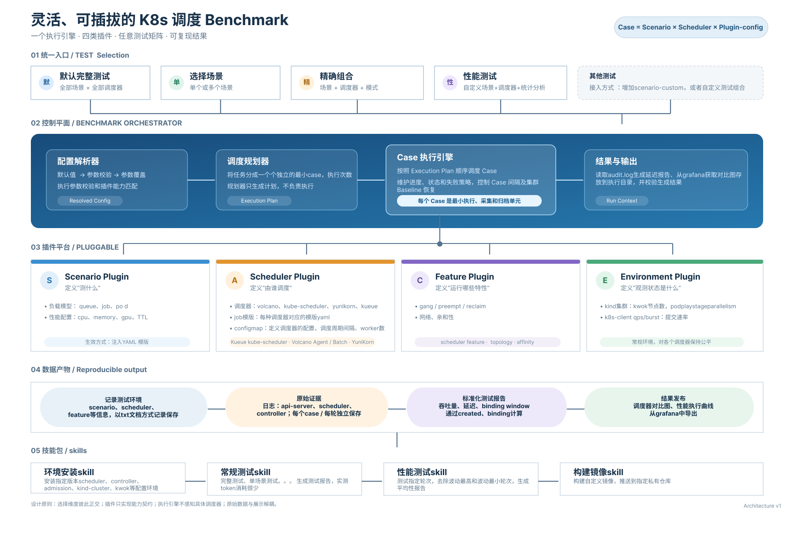
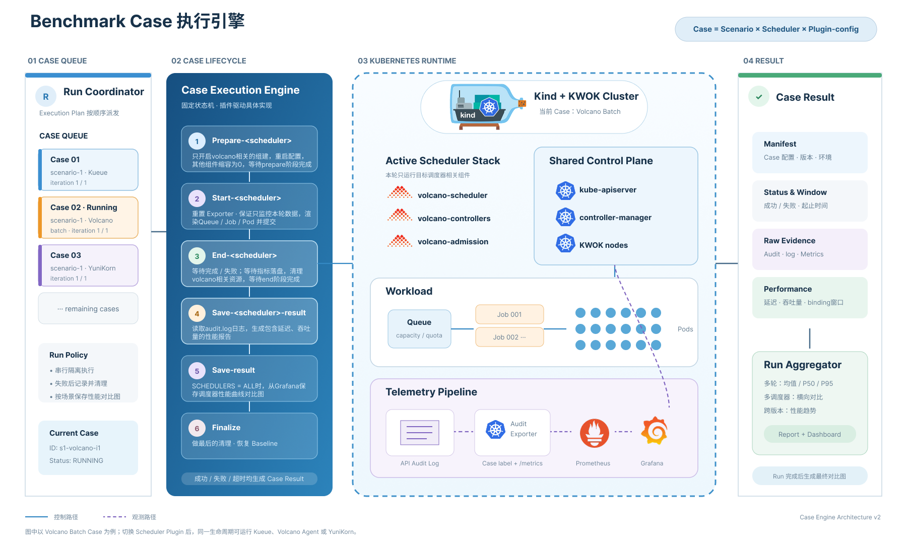

# Kubernetes 调度性能基准

[English](README.md) | 简体中文

这是一个用于比较 Kueue、Volcano 和 Apache YuniKorn 的 Kubernetes 调度性能基准框架。项目在固定复用的 Kind + KWOK 常驻集群上串行运行相同的批处理负载，在不同调度方案之间隔离组件，并将 API Server 审计指标、调度统计和 Grafana 面板保存到稳定的场景结果目录中。

## 架构



## 常驻 Kind 集群

这是当前唯一支持的执行模式。首次部署会创建 1 个 Kind 控制面节点和 1000 个 KWOK 节点，并安装三套调度方案与监控组件；测试期间只切换组件和清理资源，不重建集群。通用真实 Kubernetes 集群暂未支持。

### 前置条件

- Docker、Kind `v0.32.0`、Helm 3、curl、jq、Make、tar、sha256sum、ss、install
- 建议参考已验证主机：Ubuntu 24.04、32 逻辑 CPU、62 GiB 内存

### 一键安装（全新集群）

```bash
sudo -i
cd /path/to/kube-scheduling-perf
make setup
make up
```

`make setup` 会同步部署包、检查宿主、创建 100 节点金丝雀环境、安装并冒烟验证调度器和监控、扩容至 1000 个 KWOK 节点并完成验收；`make up` 验证集群并构建测试二进制。

> 仅用于全新部署；发现同名集群时会拒绝执行，且不会自动删除或回滚。若 Kind 创建中途失败，应先检查并补齐控制面配置，或在确认无数据需保留后由用户显式删除不完整集群。

### 分步安装

以下命令均在仓库根目录、root shell 中执行。

#### 1. 准备部署包

```bash
make prepare-resident
```

同步部署包，检查宿主，并准备 kubectl、调度器和监控制品。

#### 2. 创建 Kind 集群

```bash
make create-cluster
```

创建控制面并启用 API Server 审计。

#### 3. 创建 KWOK 节点

```bash
make create-nodes
```

安装 KWOK，创建并验收 100 个金丝雀节点。

#### 4. 安装调度器

```bash
make install-schedulers
```

安装 Kueue/Coscheduling、Volcano 和 YuniKorn，并执行调度冒烟测试。

#### 5. 安装 Audit Exporter 和监控

```bash
make install-monitoring
```

安装 Audit Exporter、Prometheus、Grafana 和图片渲染器。

#### 6. 安装 Grafana Ingress

```bash
make install-grafana-ingress
```

#### 7. 扩容并验收

```bash
make scale-nodes
make verify-resident
make up
```

扩容至 1000 个 KWOK 节点，完成集群、调度器、监控和 Ingress 验收，再构建测试二进制。冒烟测试会创建并删除真实资源；扩容只增不减。失败续跑说明见 [部署包文档](deploy/resident/README.md)。Grafana 开启匿名访问，应限制 `31003`、`31004`、`31005` 的外部来源。

### 固定基线

| 项目 | 当前基线 |
| --- | --- |
| 集群 | `volcano-benchmark-1348`；Kubernetes `v1.34.8` |
| 节点 | 1 个控制面节点 + 1000 个 KWOK `v0.7.0` 节点 |
| 调度方案 | Volcano `v1.15.1`；Kueue `v0.19.0`；Coscheduling `v0.34.7`；YuniKorn `v1.9.0` |
| 监控 | kube-prometheus-stack `88.1.3` |
| 部署目录 | `/root/benchmark-1348-deploy` |
| 访问入口 | Prometheus `31003`；Grafana `31004`；Grafana Ingress `31005` |

安装路径当前固定；测试运行阶段可覆盖 `KIND_CLUSTER_NAME`、`KUBECONFIG`、`KUBECTL` 和 `RESIDENT_DEPLOY_DIR`。完整版本、资源基线与风险见 [集群部署记录](CLUSTER_DEPLOYMENT_RECORD.md)。

## 运行测试

运行任意测试模式前，先验证常驻集群并构建测试二进制：

```bash
make up
```

四种测试模式共用相同的组件切换、任务提交、指标确认、结果保存和资源清理流程：



### 1. 完整性测试

```bash
make
```

完整性测试依次运行以下八个固定场景。每个场景均使用 1 个队列、创建 10000 个 Pod，并按 Kueue → Volcano → YuniKorn 的顺序执行，共包含 24 个 `TestBatchJob` 用例。

| 场景 | 调度模式 | Job 数 | 每个 Job 的 Pod 数 | Volcano `auto` 模式 | 单调度器超时 |
| ---: | --- | ---: | ---: | --- | ---: |
| 1 | 非 Gang | 10000 | 1 | Agent | 350 秒 |
| 2 | 非 Gang | 500 | 20 | Agent | 200 秒 |
| 3 | 非 Gang | 20 | 500 | Agent | 160 秒 |
| 4 | 非 Gang | 1 | 10000 | Agent | 190 秒 |
| 5 | Gang | 10000 | 1 | Batch | 430 秒 |
| 6 | Gang | 500 | 20 | Batch | 310 秒 |
| 7 | Gang | 20 | 500 | Batch | 310 秒 |
| 8 | Gang | 1 | 10000 | Batch | 400 秒 |

如需让 Volcano 在八个场景中全部使用 Batch Scheduler：

```bash
make VOLCANO_MODE=batch
```

完整性测试通过至少需要：顶层 `make` 和最终 `make down` 成功、24/24 个用例及指标抓取屏障通过、八个结果目录更新、测试资源清零并恢复空闲基线。Dashboard 图片保存失败只记录为非阻塞异常。

`serial-test` 的子阶段使用分号串行，中间失败后后续步骤仍可能继续，因此不能只根据顶层退出码判断结果。

### 2. 固定场景测试模式

运行一个固定场景和全部三套调度方案：

```bash
make scenario-2
```

`scenario-1` 至 `scenario-8` 对应上表中的八个场景。每个场景按 Kueue → Volcano → YuniKorn 串行执行并生成三调度器对比结果。Kueue 在非 Gang 场景使用默认 kube-scheduler，在 Gang 场景使用 Coscheduling。

### 3. 运行单调度器单场景模式

只运行场景 2 的 Volcano：

```bash
make scenario-2 SCHEDULERS=volcano
```

`SCHEDULERS` 必须是 `kueue`、`volcano` 或 `yunikorn`。Volcano 还可指定调度器模式：

- `auto`：场景 1～4 使用 Agent，场景 5～8 使用 Batch。
- `agent`：使用原生 `batch/v1` Job，不支持 Gang。
- `batch`：使用 Volcano VCJob，支持 Gang。

例如，使用 Volcano Batch Scheduler 运行场景 2：

```bash
make scenario-2 SCHEDULERS=volcano VOLCANO_MODE=batch
```

单调度器模式只更新对应调度器的结果目录，不生成或覆盖三调度器相对 Dashboard。选择 Volcano 时，`agent` 与 `GANG=true` 的组合会被拒绝。

### 4. 运行自定义场景单调度器测试模式

`scenario-custom` 复用与固定场景相同的准备、测试、指标确认、清理和结果保存流程，但只允许运行一个调度器，也不会生成三调度器相对 Dashboard。

默认运行 Volcano Batch Scheduler，创建 50 个 Job、每个 Job 16 个 Pod，并关闭 Gang：

```bash
make scenario-custom
```

可从命令行覆盖全部自定义参数，例如：

```bash
make scenario-custom \
  SCHEDULERS=volcano \
  VOLCANO_MODE=batch \
  JOBS_SIZE_PER_QUEUE=100 \
  PODS_SIZE_PER_JOB=8 \
  GANG=true \
  PREEMPTION=false \
  TEST_TIMEOUT_SECONDS=600
```

结果写入 `results/scenario-custom/`。重复运行会更新其中本轮调度器的子目录以及 `envs.txt`、`result-window.txt`，不会修改场景 1～8；其他调度器已有的子目录会保留。`SCHEDULERS` 必须且只能包含 `kueue`、`volcano` 或 `yunikorn` 中的一个。

### 5. 查看结果

完整场景使用稳定目录保存结果，并替换当前模式生成的制品：

```text
results/
└── scenario-<1..8>/
    ├── envs.txt
    ├── result-window.txt
    ├── job-submission-agent.png  # Volcano Agent 模式
    ├── job-submission.png        # Volcano Batch 模式
    ├── kueue/
    │   ├── window.txt
    │   └── report.txt
    ├── volcano-agent/ 或 volcano/ # 对应当前 Volcano 模式
    │   ├── window.txt
    │   └── report.txt
    └── yunikorn/
        ├── window.txt
        └── report.txt
```

完整三调度器运行只保存 `volcano-agent/` 或 `volcano/` 中与当前模式对应的报告目录。两种模式的 Dashboard 图片可以共存；新一轮只替换当前模式的图片并保留另一张。后续执行另一模式的编号场景单调度器测试时，两个 Volcano 报告目录也可能共存。

每个 `report.txt` 直接根据本轮 API Server 审计日志字节窗口计算 Pod 创建到绑定的 P50、P90、P99 延迟、实际调度数量、吞吐和吞吐时间窗，不使用 Prometheus Histogram 估算。编号场景的单调度器测试只替换对应的调度器子目录，不覆盖完整对比元数据或相对 Dashboard。

持久 Grafana 入口为：

```text
http://<benchmark-server>:31005/grafana/d/perf/?theme=light
```

### 6. 从中断中恢复

```bash
make down
```

该目标会启用全部调度组件和 Audit Exporter，清理 Kueue、Volcano、YuniKorn 测试资源，等待固定副本基线，并再次验证基础集群。它不依赖之前保存的运行状态。

## 参考信息

### 基准参数

| 变量 | 默认值 | 说明 |
| --- | ---: | --- |
| `SCHEDULERS` | `kueue volcano yunikorn` | 要运行的调度方案及顺序 |
| `VOLCANO_MODE` | `auto` | Volcano 模式：`auto`、`agent` 或 `batch` |
| `QUEUES_SIZE` | `1` | 基准队列数 |
| `JOBS_SIZE_PER_QUEUE` | `1` | 每个队列创建的 Job 数 |
| `PODS_SIZE_PER_JOB` | `1` | 每个 Job 创建的 Pod 数 |
| `CPU_REQUEST_PER_POD` | `1` | 每个 Pod 的 CPU 请求 |
| `MEMORY_REQUEST_PER_POD` | `1Gi` | 每个 Pod 的内存请求 |
| `CPU_PER_QUEUE` | `10000` | 每个队列的 CPU 容量 |
| `MEMORY_PER_QUEUE` | `10000Gi` | 每个队列的内存容量 |
| `GANG` | `false` | 是否启用 Gang 调度语义 |
| `PREEMPTION` | `false` | 是否启用抢占场景 |
| `TEST_TIMEOUT_SECONDS` | `3600` | 单个调度器测试的 Go 测试超时 |
| `CLEANUP_TIMEOUT_SECONDS` | `600` | Kueue 命名空间资源清理确认的最长等待时间 |
| `RESULT_METRICS_TIMEOUT_SECONDS` | `240` | 等待指标稳定并被 Prometheus 抓取的最长时间 |

影响型和关键型工作负载的其他变量定义在 [Makefile](Makefile) 顶部。

### 指标采集

本项目使用 [kube-apiserver-audit-exporter](https://github.com/songmingming0827/kube-apiserver-audit-exporter) 将 kube-apiserver 审计事件转换为 Prometheus 指标，用于统计调度延迟、API 请求和工作负载调度情况。具体的工作原理、指标定义、配置和部署方式由该仓库统一维护，此处不再展开。

### Benchmark 波动性说明

为减少重复测试之间的吞吐和延迟波动，当前基线统一了以下三项：

1. **固定 Volcano 调度周期**：Batch Scheduler 的 `schedule-period` 固定为 `200ms`，Agent Scheduler 保持事件驱动，避免调度周期配置差异影响结果。
2. **隔离 Pod 删除干扰**：固定 VCJob TTL 和清理流程，并在每轮结束后等待测试资源归零，减少 Garbage Collector 删除事件和 Scheduler cache 更新对后续测试的干扰。
3. **降低 KWOK 状态推进并发**：将 `podPlayStageParallelism` 固定为 `1`，摊平 Pod 的 Running、Succeeded 和 Deleted 状态更新，减少集中 `UpdatePod` 带来的 cache 与运行时竞争。

### 调度方案

| 调度方案 | 组件与行为 |
| --- | --- |
| Kueue | Kueue Controller；非 Gang 使用默认 kube-scheduler，Gang 使用 Coscheduling Scheduler 和 Controller |
| Volcano | Agent 模式启用 Agent Scheduler 和 Admission；Batch 模式启用 Batch Scheduler、Controllers 和 Admission |
| YuniKorn | YuniKorn Scheduler 和 Admission Controller |

三套测试分别使用 `bench-kueue`、`bench-volcano` 和 `bench-yunikorn` 命名空间。运行一套方案时，其他调度栈会缩容为 0；测试结束后清理该命名空间和相关集群级资源，再将全部调度组件恢复为 1 个副本。

### 仓库结构

```text
Makefile                    # 环境安装、测试运行、清理和结果归档入口
deploy/resident/            # 版本化常驻集群部署包
deploy/grafana-ingress/     # 持久 Grafana Ingress
hack/                       # 结果采集、Dashboard 和辅助脚本
test/                       # Kueue、Volcano、YuniKorn 测试及公共工具
results/                    # 生成的基准结果
doc/                        # 评审、分析和历史测试文档
```

进一步阅读：

- [完整性测试报告-volcano-batch-scheduler版](perf-analysis-report.md)
- [完整性测试报告-volcano-agent-scheduler版](perf-analysis-report-agent.md)
- [常驻集群部署包说明](deploy/resident/README.md)
- [常驻集群方案细节](RESIDENT_CLUSTER_PLAN_DETAIL.md)
- [集群部署记录](CLUSTER_DEPLOYMENT_RECORD.md)
- [历史完整测试报告](doc/RESIDENT_CLUSTER_FULL_TEST_REPORT.md)

### 适用边界与风险

- 测试运行流程依赖上述固定基线；`make setup` 只初始化本文约定的 Linux + Kind + KWOK 环境，不是通用现有 Kubernetes 集群安装器。
- 1000 个 KWOK 节点中只有 255 个具有唯一 PodCIDR。该环境适合虚拟调度压测，不适合验证真实容器、Pod 网络或跨 Pod 通信。
- 控制面使用很长的 Node 监控周期以降低虚拟节点开销，真实节点故障感知会明显变慢；该集群不应作为通用 Kubernetes 集群使用。
- Prometheus 和 Grafana 使用 `emptyDir`；Pod 删除或重建后历史指标和手工状态会丢失。需要长期留存时应另行导出。
- 宿主机的 `31003`、`31004`、`31005` 均绑定到 `0.0.0.0`，公网可达性取决于防火墙和云安全组；`31004` 和 `31005` 访问的是启用匿名 Viewer 的 Grafana。应限制这三个端口的访问来源。
- 当前审计策略只记录性能分析所需的资源和操作，不是完整的安全审计策略。
