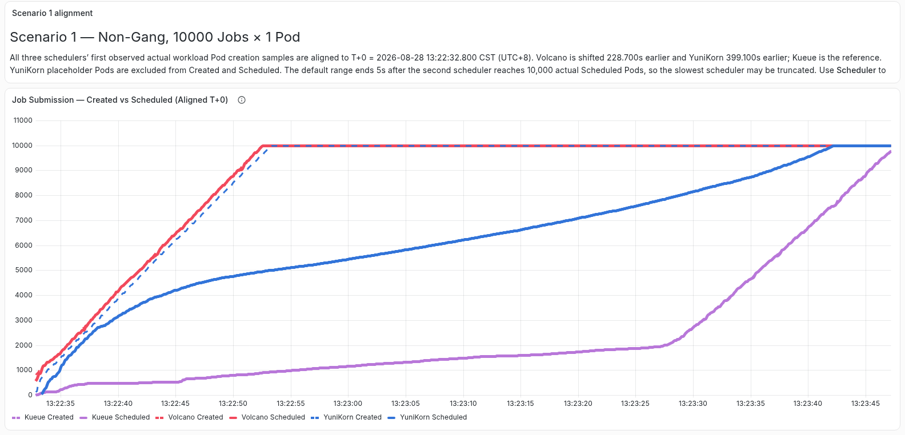
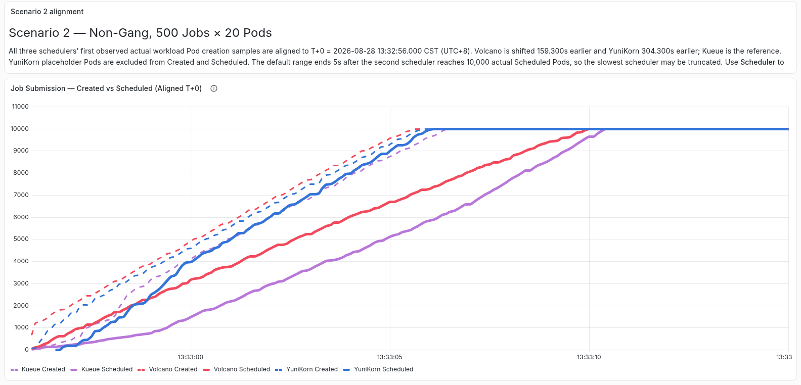
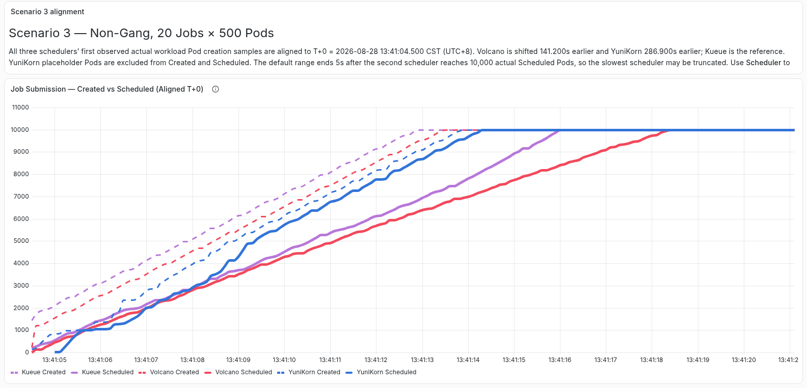
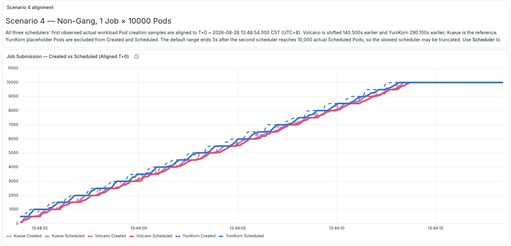

# 背景

## 调度器版本

## 参数配置	

| 对比方案        | 组件与作用                       | CPU request/limit | Kubernetes client QPS/Burst                               | 并发或Worker                                      | 调度周期                 |
| --------------- | -------------------------------- | ----------------- | --------------------------------------------------------- | ------------------------------------------------- | ------------------------ |
| Kueue 非 Gang   | `kube-scheduler`                 | `500m / 8`        | `1000/1000`                                               | /                                                 | 事件驱动，无固定调度周期 |
| Kueue 准入      | `kueue-controller-manager`       | `500m / 8`        | `1000/1000`                                               | job、workload等worker均为100                      |                          |
| kueue           | kube-controller-manager          | `500m / 8`        | `1000/1000`                                               | Job Controller Worker=100                         |                          |
| Kueue Gang      | `coscheduling`，实际调度 Pod     | `500m / 8`        | `1000/1000`                                               | /                                                 | 事件驱动，无固定调度周期 |
| Kueue Gang 辅助 | `scheduler-plugins-controller`   | `500m / 8`        | `1000/1000`                                               | workers=100                                       |                          |
| Volcano         | Scheduler、Controller、Admission | `500m / 8`        | `1000/1000`（controller 中配置 volcano client 1000/1000） | Controller 的 Job、GC、PodGroup Worker 均为 100； | 200ms (是默认值1s)       |
| YuniKorn        | Scheduler                        | `500m / 8`        | `1000/1000`                                               | /                                                 | 200ms (是默认值1s)       |
| YuniKorn        | Admission Controller             | `500m / 8`        | `1000/1000`                                               | /                                                 |                          |
| YuniKorn        | kube-controller-manager          | `500m / 8`        | `1000/1000`                                               | Job Controller Worker=100                         |                          |

> Job Controller Worker=100 表示 启动 100 个并发 worker，最多同时协调约 100 个不同的 Kubernetes Job

### volcano配置

- 固定 Actions：`enqueue`、`allocate`、`backfill`、`reclaim`
- 固定 Plugins：第一层使用 `priority`，第二层使用 `predicates` 和 `capacity`；`capacity.enableHierarchy` 固定为 `true`
- Gang 场景在第一层增加 `gang`，并设置 `enablePreemptable: false`
- Preemption 场景在 Actions 中增加 `preempt`

## 数据收集方法优化

利用 **audit-exporter** 从 kube-apiserver 中收集信息并记录在 audit.log 来准确地记录具体性能。

使用经过版本优化过后的开源测试工具 **kube-scheduling-perf** 获得测试结果。

# 测试

测试结果图来自：http://104.105.137.213:31005/grafana

## 测试cases

本次测试benchmark如下图，在10k总Pod量下，分别在启用/不启用**Gang** Scheduling的情况下，调整Job数量和每Job的Pod数量。

## 测试结果

> 说明，为了放大三个调度器在初始创建时的细节，可能会截断最慢的调度器，这是有意为之

## 非gang场景

### 场景1

10000个job，每个Job只有1个Pod，有以下现象：

- created和scheduled曲线基本重合，调度阶段不是主要瓶颈，此时性能**瓶颈为创建阶段**。
  - 原因：**k8s客户端的qps/burst为100/200**；提交时以job为整体单位提交，故提交耗时最少要(10000 - Burst 200) / QPS 100 ≈ 98 秒。
    - vc-controller创建pod耗时被掩盖：vc-controller的qps/burst为1000/1000，故创建耗时最少要(10000 - Burst 1000) / QPS 1000 ≈ 9 秒。同理vc-Admission ≈ 9 秒。

    - 由于客户端的qps，导致**pod创建速度**因j提交限制到了100pod/s，scheduler的qps是1000所以处理速度大于pod创建速度，所以曲线重合

- **volcano整体耗时100s**

### 场景2

500个job，每个Job有20个Pod，有以下现象：

调度类型不同：

1. Batch Scheduler 一次 runOnce 打开一个 Session/集群快照，然后在这个 Session 内循环处理大量待调度 Pod。

2. Agent Scheduler 是一个基于worker的并发调度循环 ，Agent Scheduler 的一个 Worker 每次只取一个 Pod，更新快照、执行 predicate/score、提交 binding，然后再取下一个 Pod。当前--scheduler-worker-count只设置为1，所以非常慢

### 场景3

20个job，每个Job有500个Pod，有以下现象：

- volcano在场景2和场景3两种情况下的调度速度几乎是不变的 - 15s左右；而kueue从场景2的15s左右时间 -> 场景3的10s左右时间
  - 场景3 Kueue 要处理 500 个 Workload 的准入，场景2只用20个
  

### 场景4

只有1个job，每个Job有10000个Pod，有以下现象：

- kube-controller创建pod速度存在瓶颈

  - 三者创建pod的controller都是kube-controller，**环境设置：**job-controller worker为100；1. 单个 Job 每次同步最多创建 `500` 个 Pod。2. 同一个 Job key 不会被多个 worker 同时处理。3. Pod 事件触发的下一轮 Job 同步有 `1s` 批处理周期。
  - 场景 3 有 20 个独立 Job key，每个 Job 正好只需要一轮 500 Pod。
  - 场景 4 只有一个 Job key，需要 `10000 / 500 = 20` 轮同步。从首轮到末轮约有 19 个一秒间隔，实测正好约 19.1–19.5 秒。

  

