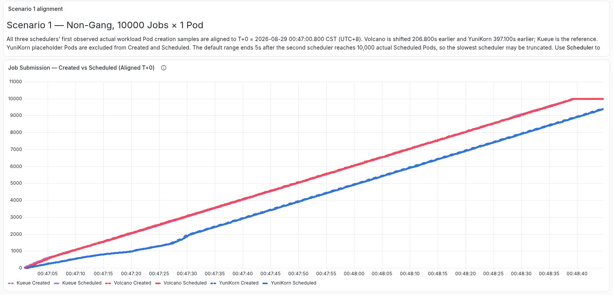
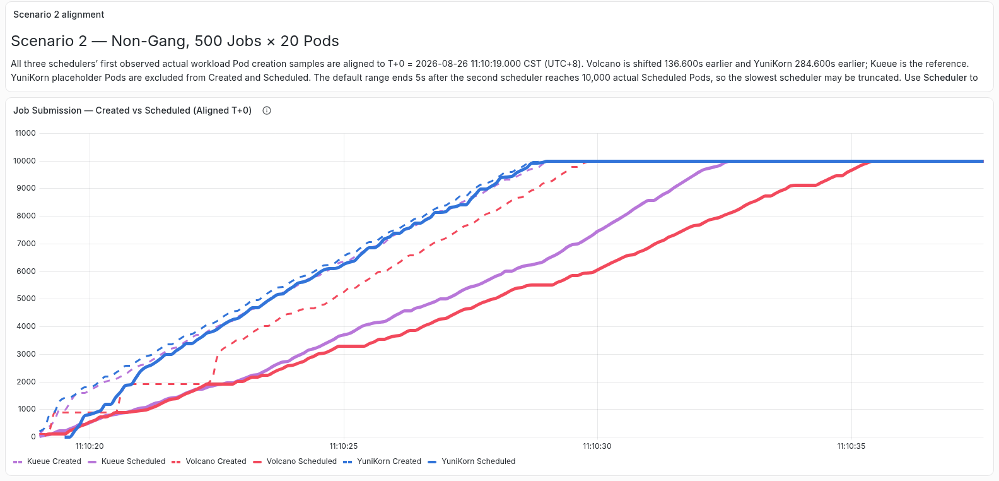
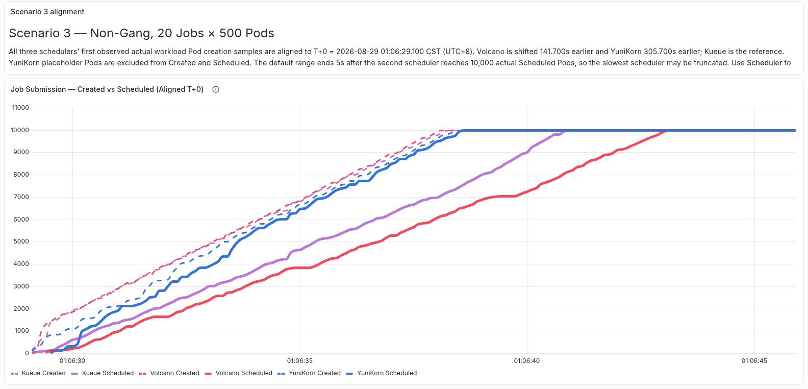
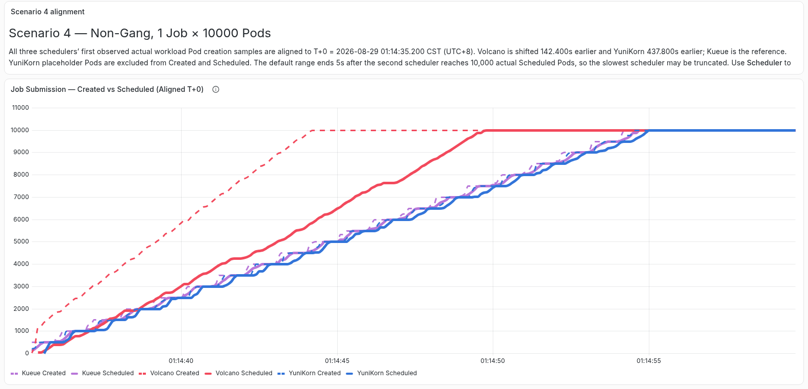
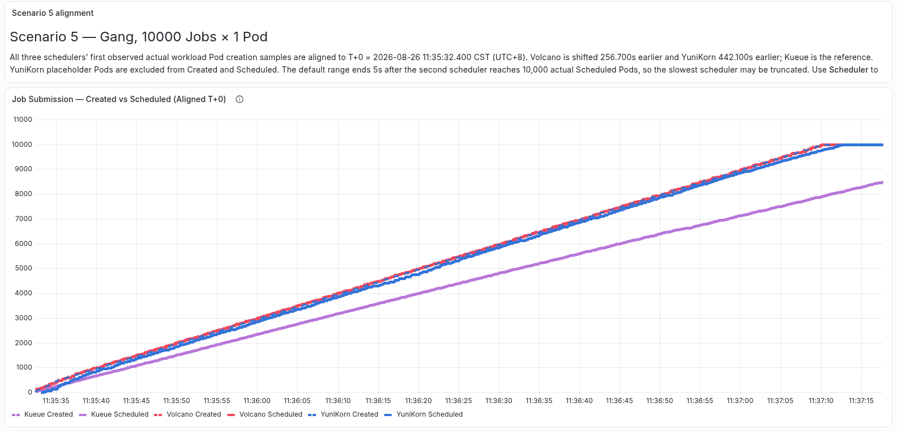
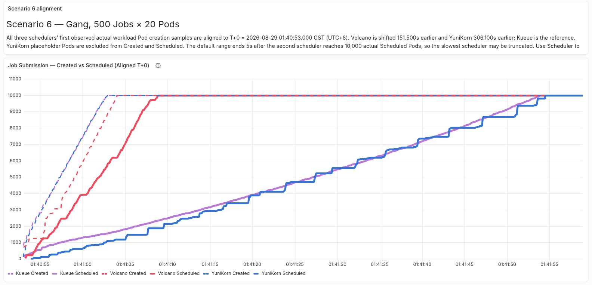
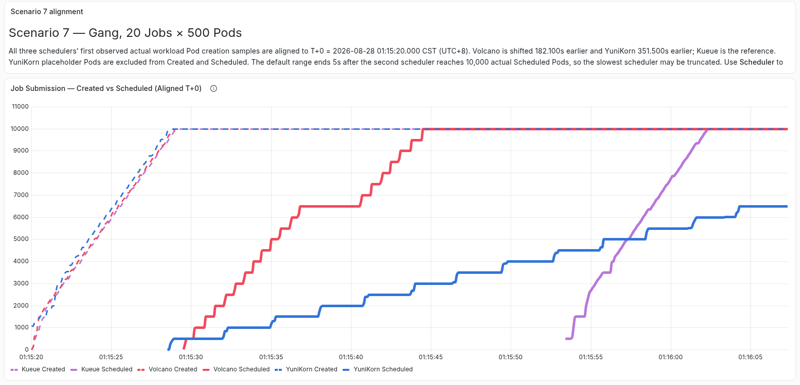
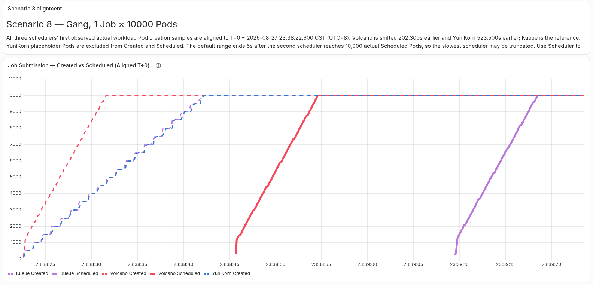

# 背景

## 调度器版本

## 参数配置	

| 对比方案        | 组件与作用                       | CPU request/limit | Kubernetes client QPS/Burst                               | 并发或Worker                                      | 调度周期                 |
| --------------- | -------------------------------- | ----------------- | --------------------------------------------------------- | ------------------------------------------------- | ------------------------ |
| Kueue 非 Gang   | `kube-scheduler`                 | `500m / 8`        | `1000/1000`                                               | /                                                 | 事件驱动，无固定调度周期 |
| Kueue 准入      | `kueue-controller-manager`       | `500m / 8`        | `1000/1000`                                               | job、workload等worker均为100                      |                          |
| kueue           | kube-controller-manager          | `500m / 8`        | `1000/1000`                                               | Job Controller Worker=100                         |                          |
| Kueue Gang      | `coscheduling`，实际调度 Pod     | `500m / 8`        | `1000/1000`                                               | /                                                 | 事件驱动，无固定调度周期 |
| Kueue Gang 辅助 | `scheduler-plugins-controller`   | `500m / 8`        | `1000/1000`                                               | workers=100                                       |                          |
| Volcano         | Scheduler、Controller、Admission | `500m / 8`        | `1000/1000`（controller 中配置 volcano client 1000/1000） | Controller 的 Job、GC、PodGroup Worker 均为 100； | 200ms (是默认值1s)       |
| YuniKorn        | Scheduler                        | `500m / 8`        | `1000/1000`                                               | /                                                 | 200ms (是默认值1s)       |
| YuniKorn        | Admission Controller             | `500m / 8`        | `1000/1000`                                               | /                                                 |                          |
| YuniKorn        | kube-controller-manager          | `500m / 8`        | `1000/1000`                                               | Job Controller Worker=100                         |                          |

> Job Controller Worker=100 表示 启动 100 个并发 worker，最多同时协调约 100 个不同的 Kubernetes Job

### volcano配置

- 固定 Actions：`enqueue`、`allocate`、`backfill`、`reclaim`
- 固定 Plugins：第一层使用 `priority`，第二层使用 `predicates` 和 `capacity`；`capacity.enableHierarchy` 固定为 `true`
- Gang 场景在第一层增加 `gang`，并设置 `enablePreemptable: false`
- Preemption 场景在 Actions 中增加 `preempt`

## 数据收集方法优化

利用 **audit-exporter** 从 kube-apiserver 中收集信息并记录在 audit.log 来准确地记录具体性能。

使用经过版本优化过后的开源测试工具 **kube-scheduling-perf** 获得测试结果。

# 测试

测试结果图来自：http://104.105.137.213:31005/grafana

## 测试cases

本次测试benchmark如下图，在10k总Pod量下，分别在启用/不启用**Gang** Scheduling的情况下，调整Job数量和每Job的Pod数量。

## 测试结果

> 说明，为了放大三个调度器在初始创建时的细节，可能会截断最慢的调度器，这是有意为之

## 非gang场景

### 场景1

10000个job，每个Job只有1个Pod，有以下现象：

- created和scheduled曲线基本重合，调度阶段不是主要瓶颈，此时性能**瓶颈为创建阶段**。
  - 原因：**k8s客户端的qps/burst为100/200**；提交时以job为整体单位提交，故提交耗时最少要(10000 - Burst 200) / QPS 100 ≈ 98 秒。
    - vc-controller创建pod耗时被掩盖：vc-controller的qps/burst为1000/1000，故创建耗时最少要(10000 - Burst 1000) / QPS 1000 ≈ 9 秒。同理vc-Admission ≈ 9 秒。

    - 由于客户端的qps，导致**pod创建速度**因j提交限制到了100pod/s，scheduler的qps是1000所以处理速度大于pod创建速度，所以曲线重合

- **volcano整体耗时100s**

### 场景2

500个job，每个Job有20个Pod，有以下现象：

- Volcano的调度速度慢于另外两种调度器；
- **创建时间**比场景一更快
  - 客户端qps/burst为100/200，这里只有500个job，提交耗时会更少，最少要(500 - Burst 200) / QPS 100 ≈ 3 秒。
  - vc-controller的k8s client qps/burst为1000/1000，需要创建10000，创建最少耗时为（10000 - Burst1000）/ QPS 1000 ≈ 9 秒。**提交时间 < 创建时间**，所以这里提交时间几乎不影响创建pod的时间。
    - 但是由于有500个job，导致会vc-controller在创建podgroup，更新job时花费过多时间，导致整体pod创建时间增多，这里甚至可能达不到k8s client的qps限流
  - 历史测试提示：当时 kube-controller-manager 的 qps/burst 误设为 `5000/10000`，因此 YuniKorn 的创建时间小于 9s；当前集群已修正为 `1000/1000`。

- **created阶段性突变**现象（正常情况下created应该匀速增加，这里的现象说明controller创建pod时会间歇性卡住一会儿）。
  - **vc-controller的worker为100**，所以worker一起工作时能够处理100个job，故最多能产出2000个pod，开始时burst=200，所有worker一起开始工作，进度几乎一样，所以可以看到pod在**2000和4000左右会有“停滞”**，随着时间推移，各个worker工作进度不同，**错峰执行**，整个pod的产出曲线就变的**平滑**了；
    - 同时各个worker错峰，会使创建pod的时间更分散，这样controller的qps/burst(1000/1000)的等待时间就会变少甚至没有，所以可以看到后**半程创建300个job的时间比前面200个job甚至更短**。

- **scheduled明显滞后于created**，说明调度速度较慢，此时性能**瓶颈为调度**；
  - 原因是**scheduler的处理速度 < pod创建速度**；
  - scheduler整体耗时 = 调度器执行时间 + 周期等待时间
    - **周期等待时间**：调度周期为1秒，经历x轮调度就会额外增加x-1秒的周期等待时间；**调度器的执行时间**：scheduler执行action、plugin所花费的时间，例如节点过滤、评分和Binding等；（scheduler的qps为1000，所以理论上最快的处理速度是（10000 - burst 1000）/ qps 1000 = 9秒，整体调度时间远大于9s，所以qps几乎不会限制scheduler的处理速度。）

- **volcano整体耗时接近22s**，创建耗时15s，调度耗时20s

### 场景3

20个job，每个Job有500个Pod，有以下现象：

- volcano**创建**pod速度比场景2更快
  - 由于job数量变少，创建podgroup和更新job状态不再限制pod的创建，所以volcano-client大概率能产出大量pod创建请求，能够打满k8s-client qps 1000的设置，所以这里pod创建时间在9s左右基本符合预期。
    - VC Controller的Kubernetes Client主要用于Pod创建，Job/PodGroup及Pod状态更新由其他客户端承担。例如：Job、PodGroup状态：VC Controller的volcano-client；Binding及部分调度状态：Volcano Scheduler自己的k8s-client；

- scheduled仍然明显滞后于created，说明**调度**速度较慢，此时性能**瓶颈为主要是调度器**。
- **volcano整体耗时接近20s**，创建耗时9s，调度耗时18s

### 场景4

只有1个job，每个Job有10000个Pod，有以下现象：

- **Volcano调度速度，创建速度几乎不变；**
- yunikorn和kueue由创建速度变慢导致整体时间变长。
  - 场景3创建时间为11、5 =》18、18

- **volcano整体耗时接近18s**，创建耗时9s，调度耗时17s。

#### 总结

1. 整体耗时大致呈现 pod总数一定的情况下，job数量越少，调度越快的趋势；Volcano 的总调度时间基本与 Job 数量成正比，说明其性能**瓶颈主要由 Job 导致**。
   1. job越少，vc-client的压力越少，越能更快的提交创建pod请求。

2. 当job数量越少，也就是job包含的pod数量越多，此时，scheduled会呈现明显滞后于created的情况，说明此时整体的**性能瓶颈在调度器**。（如图场景2-场景4）
   1. scheduler调度速度 < pod创建速度

## gang场景

### 场景5

10000个job，每个Job只有1个Pod，有以下现象：

- 和场景1类似，created和scheduled曲线重合，说明调度阶段不为瓶颈，此时**性能瓶颈为创建阶段**。
- **volcano整体调度耗时接近100s**，和场景1耗时接近

### 场景6 🌟

500个job，每个Job有20个Pod，有以下现象：

- kueue、yunikorn和场景二的曲线几乎保持一致；不同的是**volcano调度速度明显变快**，从场景2的明显落后于另外两组调度器，到领先另外两组调度器；值得注意的是，**volcano在gang场景下创建pod的速度也变快了**。gang 并未直接优化 Pod 创建逻辑，分析可能的原因是调度请求更加批次化，**减少了与controller争用api-server的情况**，因此间接提高了创建吞吐量。
- **volcano整体调度耗时20s**，和场景2耗时接近

### 场景7🌟

20个job，每个Job有500个Pod，有以下现象：

- 整体created创建曲线和场景3类似，但是除volcano外，**另外两组调度器在gang场景下明显更慢**，yunikorn甚至直接超出画面；相反，**volcano在两种场景下调度速度接近**，因此能够超过kueue、yunikorn。
- **volcano整体调度耗时接近30s**
  - 没有满足job越少，调度时间越短的的情况；可以看到，开始阶段scheduled的pod出现的很晚，推测原因可能是单个 Gang 较大，Scheduler 需要等待整组 Pod 准备并完成整体资源判断所花费较长时间；
  - volcano调度曲线出现两次**长阶梯**，主要原因是因为要等待当前轮的 Pod 状态和事件发布 完成后才会开启下一轮调度，加上200ms的调度周期间隔，大概2～3秒。

### 场景8 

只有1个job，每个Job有10000个Pod，有以下现象：

- created创建曲线和场景4类似，不过由于volcano调度器在gang场景下的优势，10000个pod全部被调度成功的速度最快
- volcano整体调度耗时接近45s

#### 总结

- Gang 场景是 Volcano 的优势场景。场景 5–8 中 Volcano 均较快，尤其场景 6–8 优势明显。

- 场景 7、8 不能简单套用“Job 越少越快”。这可能是因为单个 Gang 越大，Scheduler 越需要等待整组 Pod 准备并完成整体资源判断，因此 `minMember=500/10000` 会增加组就绪和批量绑定开销。

## 最终结果

在所测试八个场景下，volcano表现较好，有其中5个场景（4 ~ 8）volcano是调度速度更快的那个，并且场景1三组调度器的调度速度几乎持平；

同时对于要求Gang调度的此时场景，Volcano的性能都是明显最佳的。

报告链接🔗：https://github.com/songmingming0827/kube-scheduling-perf/blob/master/perf-analysis-report.md
